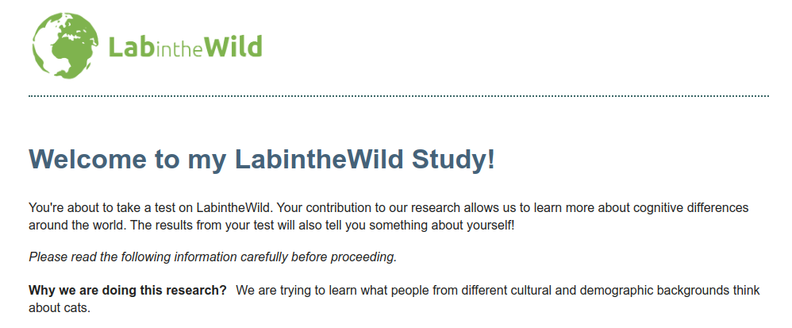

# How to... Change a page's text?

We hope that if you are here, you already have [installed](1-Installation.md) our code template and understood its [code structure](2-CodeExecutionOverview.md).
If that is the case, changing the content in a slide should be as easy as changing the content in an HTML page. Let us do just that in the `study-base` study template folder!

## Configure the IRB page

In our base template, you have probably seen, first thing, a simple **Informed Consent** page. Should be something like this:



Now, you see that the title is kind of generic. What if we change it to something more specific, like `Get your mind blown with my LabintheWild Study!`.
If you know enough of HTML and about the `timeline` configured in the `study-model.js` file, you should see that the first slide we show is called `irbTemplate` which is a variable created on the same JS file like this:

```javascript
var irbTemplate = require("../templates/irb.html");
```

Knowing that, we can go to the `irb.html` file and change it! But instead of seen a simple `H1` and `p` nodes in the page, you will find something slightly different like this:

```html
<h2 class="bolded-blue" data-i18n='litw-irb-header'></h2>
<p data-i18n='litw-irb-subheader-1'></p>
<p><em data-i18n='litw-irb-subheader-2'></em></p>
```

Why do we use this `data-i18n` instead of inserting text directly on the HTML page? That is because we are VERY pro-internalization, and even if you do not intend to translate your study right now, we believe everything should be built to make that very easy!
We use the [Wikipedia's i18n library](https://github.com/wikimedia/jquery.i18n) to make translations almost transparent to you and the study participants.
All you need to do is to open the language file (in this case `en.json`) inside the `i18n` folder of your study. Here is a snippet of it:

```json
{
  "@metadata": {
    "authors": [
      "LITW Team"
    ],
    "locale": "en",
    "message-documentation": "qqq"
  },
  "litw-template-title": "This is your Project",
  "litw-template-loading": "Loading...",
  "litw-irb-header": "Welcome to my LabintheWild Study!",
  ...
}
```
All it is, is a `key:value` JSON file with all the string you need to use in the HTML of your study.
Now, considering we want to change the text above that has the `litw-irb-header` key, go ahead and change it in the JSON file.


## Check the changes

To see the changes -- any changes from now on -- we recommend to: 
1. stop the `dev-server` if it is running (Ctrl+C on terminal)
2. build your study (as described [here](1-Installation.md#steps))
3. run the `dev-server`
4. access the study folder on a browser windows... something like `http://localhost:8080/study-base/index.html`!

You should now see the new title of your study.

## What now?

We're so excited you got here! Now that you know how the basic of a study slide, maybe you want to [add a whole new page](4-AddNewPage.md) to your study?

## What if this did not work?

1. Did you really refresh all components? Cash can always be an annoying thing while making small changes like this!
2. Try to open your browser console, deactivate cashing, and reflesh the page. (Maybe opening the URL in a private windows may help with cash as well.)
3. If you could not make this work:
   1. Search [our discussions](https://github.com/labinthewild/LITW-study-templates/discussions) for an answer.
   2. Open [an issue](https://github.com/labinthewild/LITW-study-templates/issues)!