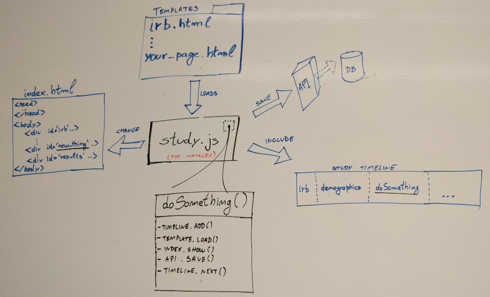

# Code Overview

With this small overview we want you to meet the main concepts and files related to a page in the template.

In this diagram you can see the following entities:

  - **study.js:** This is the workflow's manager. It is composed by a set of functions normally associated with presenting a page to the study's participants, collecting and saving necessary data, and leaving space for the next page.
  - **templates:** Is a folder full of HTML page structures that are loaded, filled up with content and presented to the participant.
  - **index.html:** This is the page that the study participant is interacting with all the time. Its structure -- based on a list of empty DIVs -- present the pages that compose a study which will be filled up in runtime by the workflow manager.
  - **timeline:** A timeline containing all the steps that compose the study. In general each step is a algorithm that shows a page and collect data -- as presented in the *doSomething()* box -- but these steps can also tasks meant to run in the background.
  - **API:** This is a module created to support simple data management. In general, all you need to do is call a function that will save JSON objects.
   
Is it clearer now?

How about implementing something new in the template to get a sense of how this should be done? We've created the following HowTo tasks to warm you up:

  - How to add a new page with a small survey?
